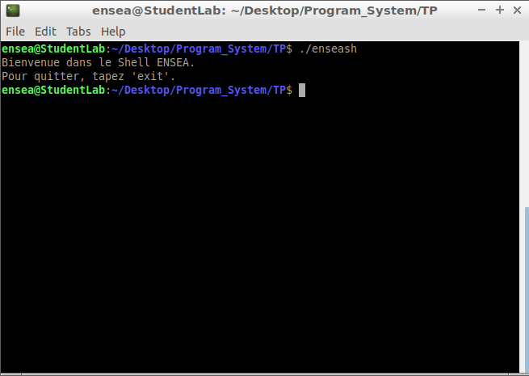
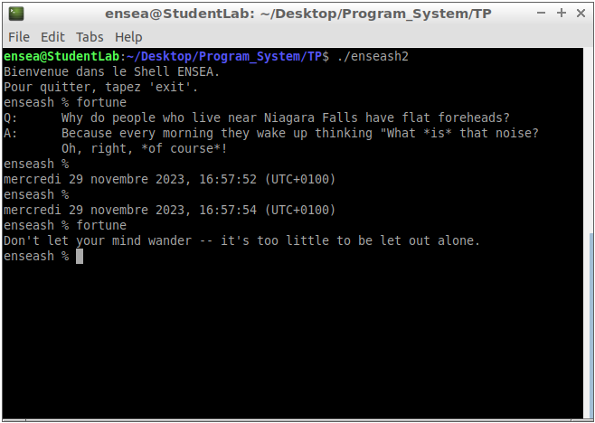
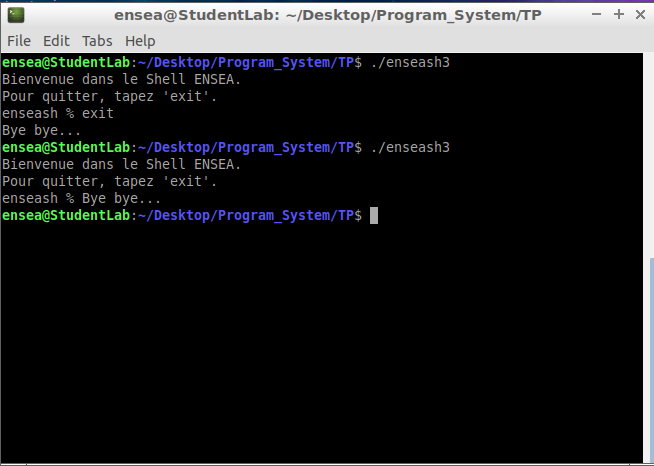
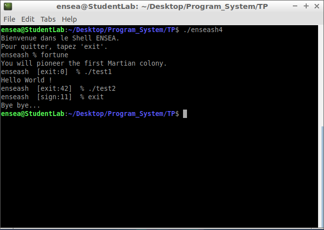
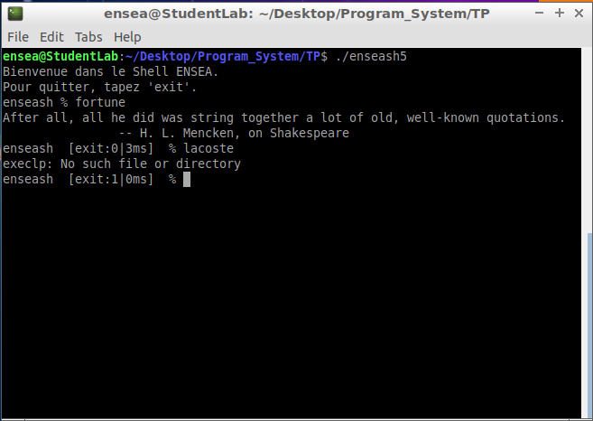
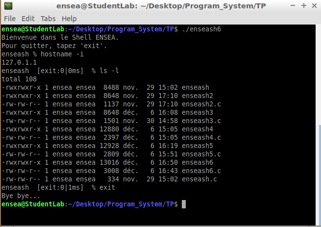

# Programmation_System 

### Question 1 :
```ruby
#include <sys/types.h>
#include <unistd.h>
#include <stdio.h>
#include <stdlib.h>
#include <string.h>     /* Inclusion of all libraries needed */

int main(int argc, char *argv[]){
	char buf[] = "Bienvenue dans le Shell ENSEA.\nPour quitter, tapez 'exit'.\n";
	size_t size1 = strlen(buf);
	write(STDOUT_FILENO,buf,size1);
}

```


=> For this first program, we have created a mini shell, with a display of a simple welcoming message.

### Question 2:
```ruby
#include <sys/types.h>
#include <unistd.h>
#include <stdio.h>
#include <stdlib.h>
#include <string.h>
#include <sys/wait.h>	/* Inclusion of all libraries needed */

int main(int argc, char *argv[]){
	
	char buf[] = "Bienvenue dans le Shell ENSEA.\nPour quitter, tapez 'exit'.\n";
	char prompt[] = "enseash % ";
	char clav[32];		/* Character strings for the command entered with the keyboard in the console */
	char date[] = "date";
	size_t size1 = strlen(buf);
	size_t size2 = strlen(prompt);		/* Here we have all character strings and size that we need */
	
	if(write(STDOUT_FILENO, buf,size1) == -1){
        	perror("write");
		exit(EXIT_FAILURE);
	}
	
	while(1){						/* Infinite loop */
		
  		if(write(STDOUT_FILENO, prompt,size2) == -1){		/* Display of prompt line */
			perror("write");
			exit(EXIT_FAILURE);
  		}
  	
  		ssize_t bytesRead = read(STDIN_FILENO, clav, sizeof(clav));		/* Reading of the command */
    		if (bytesRead == -1) {
          		perror("read");
          		exit(EXIT_FAILURE);
    		}
  
    		clav[bytesRead - 1] = '\0';		/* We delete the last element of the character strings */
  	
    		int pid, status;
  		pid = fork();
  	
  		if (pid != 0){			/* Father's code */
			wait(&status);
  		}
  	
  		else{						/* Child's code */
  		 	 if (strlen(clav) == 0) {		/* Test if we just do "Enter" */
                		execlp(date, date, (char *)NULL);
        		}
  		  	else{					/* If not, we launch the command that the user sent */
                		execlp(clav, clav,(char *)NULL);
  		  	}
  	 	}
	}
  }
```


=> For this second part, we did an infinite loop where the user can enter a command of his choice and launch it, or if he don't enter anything, we display the date.

### Question 3:
```ruby
#include <sys/types.h>
#include <unistd.h>
#include <stdio.h>
#include <stdlib.h>
#include <string.h>
#include <sys/wait.h>

int main(int argc, char *argv[]) {
    	char buf[] = "Bienvenue dans le Shell ENSEA.\nPour quitter, tapez 'exit'.\n";
    	char prompt[] = "enseash % ";
	char clav[32];
    	char date[] = "date";
    	char bye[] = "Bye bye...\n";

    	size_t size1 = strlen(buf);
    	size_t size2 = strlen(prompt);

	int pid, status;
	pid = fork();
    
    	if (write(STDOUT_FILENO, buf, size1) == -1) {
        	perror("write");
        	exit(EXIT_FAILURE);
    	}

    	while (1) {
		if (write(STDOUT_FILENO, prompt, size2) == -1) {
            		perror("write");
            		exit(EXIT_FAILURE);
        	}
        
		ssize_t bytesRead = read(STDIN_FILENO, clav, sizeof(clav));
    		if (bytesRead == -1) {
        		perror("read");
        		exit(EXIT_FAILURE);
       	 	}

   	 	else if (bytesRead == 0) {				/* We test here if the user type <crtl> + d, and if the test is verified, we go out of the shell */
			write(STDOUT_FILENO, bye, sizeof(bye));
            		exit(EXIT_SUCCESS);
        	}

        	clav[bytesRead - 1] = '\0';
    
     		if (strcmp(clav, "exit") == 0) {			/* We test if the user typed "exit", and if yes, we go out of the code as well without making a fork */
            		write(STDOUT_FILENO, bye, sizeof(bye));
            		exit(EXIT_SUCCESS);
        	}

		if (pid != 0) {
            		wait(&status);
        	}

		else {
            		if (strlen(clav) == 0) {
                		execlp(date, date, (char *)NULL);
            		}
            		else {
                		execlp(clav, clav, (char *)NULL);
            		}
        	}
       }
	return 0;
}
```



=> Here, we have upgraded a little bit our previous code to have more tests on what the user type in the prompt. 


### Question 4
```ruby

#include <sys/types.h>
#include <unistd.h>
#include <stdio.h>
#include <stdlib.h>
#include <string.h>
#include <sys/wait.h>

void display_status(char *prompt, int status) {
    char exit_prompt[32];
    
    if (WIFEXITED(status)) {
        sprintf(exit_prompt, " [exit:%d] ", WEXITSTATUS(status));
        write(STDOUT_FILENO, prompt, strlen(prompt)-2);
        write(STDOUT_FILENO, exit_prompt, strlen(exit_prompt));
        write(STDOUT_FILENO, " % ", 3);
    } 
    
    else if (WIFSIGNALED(status)) {
        sprintf(exit_prompt, " [sign:%d] ", WTERMSIG(status));
        write(STDOUT_FILENO, prompt, strlen(prompt)-2);
        write(STDOUT_FILENO, exit_prompt, strlen(exit_prompt));
        write(STDOUT_FILENO, " % ", 3);
    }
}

int main(int argc, char *argv[]) {
    char buf[] = "Bienvenue dans le Shell ENSEA.\nPour quitter, tapez 'exit'.\n";
    char prompt[] = "enseash % ";
    char clav[32];
    char date[] = "date";
    char bye[] = "Bye bye...\n";

    size_t size1 = strlen(buf);
    size_t size2 = strlen(prompt);

    if (write(STDOUT_FILENO, buf, size1) == -1) {
        perror("write");
        exit(EXIT_FAILURE);
    	}
    
    if (write(STDOUT_FILENO, prompt, size2) == -1) {
            perror("write");
            exit(EXIT_FAILURE);
	}
        
    while (1) {
        

        ssize_t bytesRead = read(STDIN_FILENO, clav, sizeof(clav));
        
        if (bytesRead == -1) {
            perror("read");
            exit(EXIT_FAILURE);
        } 
        
        else if (bytesRead == 0) {
            write(STDOUT_FILENO, bye, sizeof(bye));
            exit(EXIT_SUCCESS);
        }
        
        clav[bytesRead - 1] = '\0';

        if (strcmp(clav, "exit") == 0) {
            write(STDOUT_FILENO, bye, sizeof(bye));
            exit(EXIT_SUCCESS);
        }

        int pid, status;
        pid = fork();

        if (pid == -1) {
            perror("fork");
            exit(EXIT_FAILURE);
        }
        
        if (pid != 0) {
            wait(&status);
            display_status(prompt, status);
        } 
        
        else {
            if (strlen(clav) == 0) {
                execlp(date, date, (char *)NULL);
            } 
            
            else {
                execlp(clav, clav, (char *)NULL);
            }
            
            perror("execlp");
            exit(EXIT_FAILURE);
        }
    }

    return 0;
}


```



### Question 5 :
```ruby
#include <sys/types.h>
#include <unistd.h>
#include <stdio.h>
#include <stdlib.h>
#include <string.h>
#include <sys/wait.h>
#include <time.h>

void display_status(char *prompt, int status, struct timespec *start_time) {
    char exit_prompt[32];
    
    struct timespec end_time;
    clock_gettime(CLOCK_REALTIME, &end_time);
    long elapsed_time = (end_time.tv_sec - start_time->tv_sec) * 1000 +
                        (end_time.tv_nsec - start_time->tv_nsec) / 1000000;
    
    if (WIFEXITED(status)) {
        sprintf(exit_prompt, " [exit:%d|%ldms] ", WEXITSTATUS(status), elapsed_time);
        write(STDOUT_FILENO, prompt, strlen(prompt) - 2);
        write(STDOUT_FILENO, exit_prompt, strlen(exit_prompt));
        write(STDOUT_FILENO, " % ", 3);
    } 
    
    else if (WIFSIGNALED(status)) {
        sprintf(exit_prompt, " [sign:%d|%ldms] ", WTERMSIG(status), elapsed_time);
        write(STDOUT_FILENO, prompt, strlen(prompt) - 2);
        write(STDOUT_FILENO, exit_prompt, strlen(exit_prompt));
        write(STDOUT_FILENO, " % ", 3);
    }
}

int main(int argc, char *argv[]) {
    char buf[] = "Bienvenue dans le Shell ENSEA.\nPour quitter, tapez 'exit'.\n";
    char prompt[] = "enseash % ";
    char clav[32];
    char date[] = "date";
    char bye[] = "Bye bye...\n";

    size_t size1 = strlen(buf);
    size_t size2 = strlen(prompt);

    if (write(STDOUT_FILENO, buf, size1) == -1) {
        perror("write");
        exit(EXIT_FAILURE);
   	 }
    
    if (write(STDOUT_FILENO, prompt, size2) == -1) {
            perror("write");
            exit(EXIT_FAILURE);
	}
        
    while (1) {
		
		struct timespec start_time;

        ssize_t bytesRead = read(STDIN_FILENO, clav, sizeof(clav));
        
        if (bytesRead == -1) {
            perror("read");
            exit(EXIT_FAILURE);
        } 
        
        else if (bytesRead == 0) {
            write(STDOUT_FILENO, bye, sizeof(bye));
            exit(EXIT_SUCCESS);
        }
        
        clav[bytesRead - 1] = '\0';

        if (strcmp(clav, "exit") == 0) {
            write(STDOUT_FILENO, bye, sizeof(bye));
            exit(EXIT_SUCCESS);
        }

        int pid, status;
        pid = fork();

        if (pid == -1) {
            perror("fork");
            exit(EXIT_FAILURE);
        }
        
        if (pid != 0) {
            clock_gettime(CLOCK_REALTIME, &start_time);
            wait(&status);
            display_status(prompt, status, &start_time);
        }
        
        else {
            if (strlen(clav) == 0) {
                execlp(date, date, (char *)NULL);
            } 
            
            else {
                execlp(clav, clav, (char *)NULL);
            }
            
            perror("execlp");
            exit(EXIT_FAILURE);
        }
    }

    return 0;
}

```




### Question 6 : 

```ruby
#include <sys/types.h>
#include <unistd.h>
#include <stdio.h>
#include <stdlib.h>
#include <string.h>
#include <sys/wait.h>
#include <time.h>

void display_status(char *prompt, int status, struct timespec *start_time) {
    char exit_prompt[32];
    
    struct timespec end_time;
    clock_gettime(CLOCK_REALTIME, &end_time);
    long elapsed_time = (end_time.tv_sec - start_time->tv_sec) * 1000 +
                        (end_time.tv_nsec - start_time->tv_nsec) / 1000000;
    
    if (WIFEXITED(status)) {
        sprintf(exit_prompt, " [exit:%d|%ldms] ", WEXITSTATUS(status), elapsed_time);
        write(STDOUT_FILENO, prompt, strlen(prompt) - 2);
        write(STDOUT_FILENO, exit_prompt, strlen(exit_prompt));
        write(STDOUT_FILENO, " % ", 3);
    } 
    
    else if (WIFSIGNALED(status)) {
        sprintf(exit_prompt, " [sign:%d|%ldms] ", WTERMSIG(status), elapsed_time);
        write(STDOUT_FILENO, prompt, strlen(prompt) - 2);
        write(STDOUT_FILENO, exit_prompt, strlen(exit_prompt));
        write(STDOUT_FILENO, " % ", 3);
    }
}

int main(int argc, char *argv[]) {
    char buf[] = "Bienvenue dans le Shell ENSEA.\nPour quitter, tapez 'exit'.\n";
    char prompt[] = "enseash % ";
    char clav[32];
    char date[] = "date";
    char bye[] = "Bye bye...\n";

    size_t size1 = strlen(buf);
    size_t size2 = strlen(prompt);

    if (write(STDOUT_FILENO, buf, size1) == -1) {
        perror("write");
        exit(EXIT_FAILURE);
	}
    
    if (write(STDOUT_FILENO, prompt, size2) == -1) {
            perror("write");
            exit(EXIT_FAILURE);
	}
        
    while (1) {
		
		struct timespec start_time;

        ssize_t bytesRead = read(STDIN_FILENO, clav, sizeof(clav));
        
        if (bytesRead == -1) {
            perror("read");
            exit(EXIT_FAILURE);
        } 
        
        else if (bytesRead == 0) {
            write(STDOUT_FILENO, bye, sizeof(bye));
            exit(EXIT_SUCCESS);
        }
        
        clav[bytesRead - 1] = '\0';

        if (strcmp(clav, "exit") == 0) {
            write(STDOUT_FILENO, bye, sizeof(bye));
            exit(EXIT_SUCCESS);
        }

        int pid, status;
        pid = fork();

        if (pid == -1) {
            perror("fork");
            exit(EXIT_FAILURE);
        }
        
        if (pid != 0) {
            clock_gettime(CLOCK_REALTIME, &start_time);
            wait(&status);
            display_status(prompt, status, &start_time);
        }
        
        else {
            if (strlen(clav) == 0) {
                execlp(date, date, (char *)NULL);
            } 
            
            else {
                char *token = strtok(clav, " ");
				char *arguments[32];
				int i = 0;

				while (token != NULL) {
					arguments[i++] = token;
					token = strtok(NULL, " ");
				}

				arguments[i] = NULL;
            
				execvp(arguments[0], arguments);
            
		}
            
			perror("execlp");
			exit(EXIT_FAILURE);
        }
    }

    return 0;
}

```


