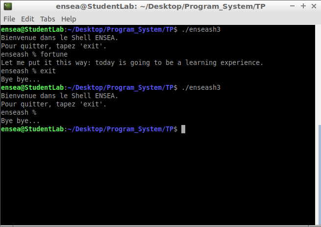
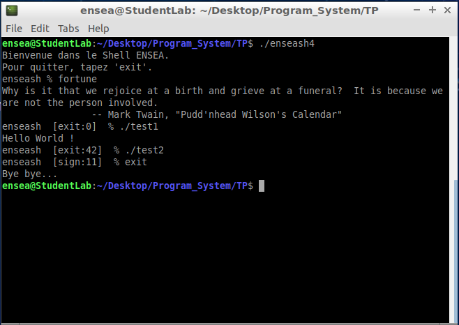

# Programmation_System 

### Question 1 :
```ruby
#include <sys/types.h>
#include <unistd.h>
#include <stdio.h>
#include <stdlib.h>
#include <string.h>     /* Inclusion of all libraries needed */

int main(int argc, char *argv[]){
	char buf[] = "Bienvenue dans le Shell ENSEA.\nPour quitter, tapez 'exit'.\n";
	size_t size1 = strlen(buf);
	write(STDOUT_FILENO,buf,size1);
}

```


=> For this first program, we have created a mini shell, with a display of a simple welcoming message.

### Question 2:
```ruby
#include <sys/types.h>
#include <unistd.h>
#include <stdio.h>
#include <stdlib.h>
#include <string.h>
#include <sys/wait.h>	/* Inclusion of all libraries needed */

int main(int argc, char *argv[]){
	
	char buf[] = "Bienvenue dans le Shell ENSEA.\nPour quitter, tapez 'exit'.\n";
	char prompt[] = "enseash % ";
	char clav[32];				/* Character strings for the command entered with the keyboard in the console */
	char date[] = "date";
	size_t size1 = strlen(buf);
	size_t size2 = strlen(prompt);		/* Here we have all character strings and size that we need */
	
	if(write(STDOUT_FILENO, buf,size1) == -1){
        	perror("write");
		exit(EXIT_FAILURE);
	}
	
	while(1){						/* Infinite loop */
		
  		if(write(STDOUT_FILENO, prompt,size2) == -1){		/* Display of prompt line */
			perror("write");
			exit(EXIT_FAILURE);
  		}
  	
  		ssize_t bytesRead = read(STDIN_FILENO, clav, sizeof(clav));		/* Reading of the command */
    		if (bytesRead == -1) {
          		perror("read");
          		exit(EXIT_FAILURE);
    		}
  
    		clav[bytesRead - 1] = '\0';		/* We delete the last element of the character strings */
  	
    		int pid, status;
  		pid = fork();
  	
  		if (pid != 0){			/* Father's code */
			wait(&status);
  		}
  	
  		else{						/* Child's code */
  		 	 if (strlen(clav) == 0) {			/* Test if we just do "Enter" */
                		execlp(date, date, (char *)NULL);
        		}
  		  	else{						/* If not, we launch the command that the user sent */
                		execlp(clav, clav,(char *)NULL);
  		  	}
  	 	}
	}
  }
```


=> For this second part, we did an infinite loop where the user can enter a command of his choice and launch it, or if he don't enter anything, we display the date.

### Question 3:
```ruby
#include <sys/types.h>
#include <unistd.h>
#include <stdio.h>
#include <stdlib.h>
#include <string.h>
#include <sys/wait.h>

int main(int argc, char *argv[]) {
    	char buf[] = "Bienvenue dans le Shell ENSEA.\nPour quitter, tapez 'exit'.\n";
    	char prompt[] = "enseash % ";
	char clav[32];
    	char date[] = "date";
    	char bye[] = "Bye bye...\n";

    	size_t size1 = strlen(buf);
    	size_t size2 = strlen(prompt);

	int pid, status;
	pid = fork();
    
    	if (write(STDOUT_FILENO, buf, size1) == -1) {
        	perror("write");
        	exit(EXIT_FAILURE);
    	}

    	while (1) {
		if (write(STDOUT_FILENO, prompt, size2) == -1) {
            		perror("write");
            		exit(EXIT_FAILURE);
        	}
        
		ssize_t bytesRead = read(STDIN_FILENO, clav, sizeof(clav));
    		if (bytesRead == -1) {
        		perror("read");
        		exit(EXIT_FAILURE);
       	 	}

   	 	else if (bytesRead == 0) {				/* We test here if the user type <crtl> + d, and if the test is verified, we go out of the shell */
			write(STDOUT_FILENO, bye, sizeof(bye));
            		exit(EXIT_SUCCESS);
        	}

        	clav[bytesRead - 1] = '\0';		/* We delete the last character of the character's chain to have only the command typed in the shell */
    
     		if (strcmp(clav, "exit") == 0) {			/* We test if the user typed "exit", and if yes, we go out of the code as well without making a fork */
            		write(STDOUT_FILENO, bye, sizeof(bye));
            		exit(EXIT_SUCCESS);
        	}

		if (pid != 0) {
            		wait(&status);
        	}

		else {
            		if (strlen(clav) == 0) {
                		execlp(date, date, (char *)NULL);
            		}
            		else {
                		execlp(clav, clav, (char *)NULL);
            		}
        	}
       }
	return 0;
}
```



=> Here, we have upgraded a little bit our previous code to have more tests on what the user type in the prompt. 


### Question 4
```ruby

#include <sys/types.h>
#include <unistd.h>
#include <stdio.h>
#include <stdlib.h>
#include <string.h>
#include <sys/wait.h>

void display_status(char *prompt, int status) {		/* This function displays different answers depending on the program entered previously */
    char exit_prompt[32];
    
    if (WIFEXITED(status)) {						/* If the program finish without errors, we display the exit code */
        sprintf(exit_prompt, " [exit:%d] ", WEXITSTATUS(status));
        write(STDOUT_FILENO, prompt, strlen(prompt)-2);
        write(STDOUT_FILENO, exit_prompt, strlen(exit_prompt));
        write(STDOUT_FILENO, " % ", 3);					/* In the order, we display enseash without "% ", [exit: "number of exit code"], " % " */
    } 
    
    else if (WIFSIGNALED(status)) {					/* If the program finish with signal error, we display the signal exit code */
        sprintf(exit_prompt, " [sign:%d] ", WTERMSIG(status));
        write(STDOUT_FILENO, prompt, strlen(prompt)-2);
        write(STDOUT_FILENO, exit_prompt, strlen(exit_prompt));
        write(STDOUT_FILENO, " % ", 3);
    }
}

int main(int argc, char *argv[]) {
    char buf[] = "Bienvenue dans le Shell ENSEA.\nPour quitter, tapez 'exit'.\n";
    char prompt[] = "enseash % ";
    char clav[32];
    char date[] = "date";
    char bye[] = "Bye bye...\n";

    size_t size1 = strlen(buf);
    size_t size2 = strlen(prompt);

    if (write(STDOUT_FILENO, buf, size1) == -1) {
        perror("write");
        exit(EXIT_FAILURE);
    	}
    
    if (write(STDOUT_FILENO, prompt, size2) == -1) {
            perror("write");
            exit(EXIT_FAILURE);
	}
        
    while (1) {
        

        ssize_t bytesRead = read(STDIN_FILENO, clav, sizeof(clav));
        
        if (bytesRead == -1) {
            perror("read");
            exit(EXIT_FAILURE);
        } 
        
        else if (bytesRead == 0) {
            write(STDOUT_FILENO, bye, sizeof(bye));
            exit(EXIT_SUCCESS);
        }
        
        clav[bytesRead - 1] = '\0';

        if (strcmp(clav, "exit") == 0) {
            write(STDOUT_FILENO, bye, sizeof(bye));
            exit(EXIT_SUCCESS);
        }

        int pid, status;
        pid = fork();

        if (pid == -1) {
            perror("fork");
            exit(EXIT_FAILURE);
        }
        
        if (pid != 0) {
            wait(&status);
            display_status(prompt, status);	/* Call of our function defined previously above */
        } 
        
        else {
            if (strlen(clav) == 0) {
                execlp(date, date, (char *)NULL);
            } 
            
            else {
                execlp(clav, clav, (char *)NULL);
            }
            
            perror("execlp");
            exit(EXIT_FAILURE);
        }
    }

    return 0;
}


```


=> For this program, we add a new feature: when a command is typed in the shell, the program return the result and the prompt diplay if the program runned correctly with the value of the exit code or the number of the signal error if one have been detected. So the prompt has been improved a little to have more information on what we tested.


### Question 5 :
```ruby
#include <sys/types.h>
#include <unistd.h>
#include <stdio.h>
#include <stdlib.h>
#include <string.h>
#include <sys/wait.h>
#include <time.h>

void display_status(char *prompt, int status, struct timespec *start_time) {		/* This addition of the previous function allows us to calculate the time in ms to run the command entered by the user */
    char exit_prompt[32];
    
    struct timespec end_time;							/* Declaration of a variable equipped with the timespec's structure */
    clock_gettime(CLOCK_REALTIME, &end_time);					/* We get the time when the function has finished running */
    long elapsed_time = (end_time.tv_sec - start_time->tv_sec) * 1000 +
                        (end_time.tv_nsec - start_time->tv_nsec) / 1000000;		/* Conversion of the time in ms */
    
    if (WIFEXITED(status)) {
        sprintf(exit_prompt, " [exit:%d|%ldms] ", WEXITSTATUS(status), elapsed_time);
        write(STDOUT_FILENO, prompt, strlen(prompt) - 2);
        write(STDOUT_FILENO, exit_prompt, strlen(exit_prompt));
        write(STDOUT_FILENO, " % ", 3);
    } 
    
    else if (WIFSIGNALED(status)) {
        sprintf(exit_prompt, " [sign:%d|%ldms] ", WTERMSIG(status), elapsed_time);
        write(STDOUT_FILENO, prompt, strlen(prompt) - 2);
        write(STDOUT_FILENO, exit_prompt, strlen(exit_prompt));
        write(STDOUT_FILENO, " % ", 3);
    }
}

int main(int argc, char *argv[]) {
    char buf[] = "Bienvenue dans le Shell ENSEA.\nPour quitter, tapez 'exit'.\n";
    char prompt[] = "enseash % ";
    char clav[32];
    char date[] = "date";
    char bye[] = "Bye bye...\n";

    size_t size1 = strlen(buf);
    size_t size2 = strlen(prompt);

    if (write(STDOUT_FILENO, buf, size1) == -1) {
        perror("write");
        exit(EXIT_FAILURE);
   	 }
    
    if (write(STDOUT_FILENO, prompt, size2) == -1) {
            perror("write");
            exit(EXIT_FAILURE);
	}
        
    while (1) {
		
		struct timespec start_time;				/* Declaration of an other variable equipped with the timespec's structure */

        ssize_t bytesRead = read(STDIN_FILENO, clav, sizeof(clav));
        
        if (bytesRead == -1) {
            perror("read");
            exit(EXIT_FAILURE);
        } 
        
        else if (bytesRead == 0) {
            write(STDOUT_FILENO, bye, sizeof(bye));
            exit(EXIT_SUCCESS);
        }
        
        clav[bytesRead - 1] = '\0';

        if (strcmp(clav, "exit") == 0) {
            write(STDOUT_FILENO, bye, sizeof(bye));
            exit(EXIT_SUCCESS);
        }

        int pid, status;
        pid = fork();

        if (pid == -1) {
            perror("fork");
            exit(EXIT_FAILURE);
        }
        
        if (pid != 0) {
            clock_gettime(CLOCK_REALTIME, &start_time);		/* Start of counting time */
            wait(&status);
            display_status(prompt, status, &start_time);
        }
        
        else {
            if (strlen(clav) == 0) {
                execlp(date, date, (char *)NULL);
            } 
            
            else {
                execlp(clav, clav, (char *)NULL);
            }
            
            perror("execlp");
            exit(EXIT_FAILURE);
        }
    }

    return 0;
}

```


=> A new improvement to our prompt, now it display also the time that the program took to entirely execute the command in ms.

### Question 6 : 

```ruby
#include <sys/types.h>
#include <unistd.h>
#include <stdio.h>
#include <stdlib.h>
#include <string.h>
#include <sys/wait.h>
#include <time.h>

void display_status(char *prompt, int status, struct timespec *start_time) {
    char exit_prompt[32];
    
    struct timespec end_time;
    clock_gettime(CLOCK_REALTIME, &end_time);
    long elapsed_time = (end_time.tv_sec - start_time->tv_sec) * 1000 +
                        (end_time.tv_nsec - start_time->tv_nsec) / 1000000;
    
    if (WIFEXITED(status)) {
        sprintf(exit_prompt, " [exit:%d|%ldms] ", WEXITSTATUS(status), elapsed_time);
        write(STDOUT_FILENO, prompt, strlen(prompt) - 2);
        write(STDOUT_FILENO, exit_prompt, strlen(exit_prompt));
        write(STDOUT_FILENO, " % ", 3);
    } 
    
    else if (WIFSIGNALED(status)) {
        sprintf(exit_prompt, " [sign:%d|%ldms] ", WTERMSIG(status), elapsed_time);
        write(STDOUT_FILENO, prompt, strlen(prompt) - 2);
        write(STDOUT_FILENO, exit_prompt, strlen(exit_prompt));
        write(STDOUT_FILENO, " % ", 3);
    }
}

int main(int argc, char *argv[]) {
    char buf[] = "Bienvenue dans le Shell ENSEA.\nPour quitter, tapez 'exit'.\n";
    char prompt[] = "enseash % ";
    char clav[32];
    char date[] = "date";
    char bye[] = "Bye bye...\n";

    size_t size1 = strlen(buf);
    size_t size2 = strlen(prompt);

    if (write(STDOUT_FILENO, buf, size1) == -1) {
        perror("write");
        exit(EXIT_FAILURE);
	}
    
    if (write(STDOUT_FILENO, prompt, size2) == -1) {
            perror("write");
            exit(EXIT_FAILURE);
	}
        
    while (1) {
		
		struct timespec start_time;

        ssize_t bytesRead = read(STDIN_FILENO, clav, sizeof(clav));
        
        if (bytesRead == -1) {
            perror("read");
            exit(EXIT_FAILURE);
        } 
        
        else if (bytesRead == 0) {
            write(STDOUT_FILENO, bye, sizeof(bye));
            exit(EXIT_SUCCESS);
        }
        
        clav[bytesRead - 1] = '\0';

        if (strcmp(clav, "exit") == 0) {
            write(STDOUT_FILENO, bye, sizeof(bye));
            exit(EXIT_SUCCESS);
        }

        int pid, status;
        pid = fork();

        if (pid == -1) {
            perror("fork");
            exit(EXIT_FAILURE);
        }
        
        if (pid != 0) {
            clock_gettime(CLOCK_REALTIME, &start_time);
            wait(&status);
            display_status(prompt, status, &start_time);
        }
        
        else {
            if (strlen(clav) == 0) {
                execlp(date, date, (char *)NULL);
            } 
            
            else {						/* Here, we are improving the previous else loop by taking commands with arguments*/
                char *token = strtok(clav, " ");		/* Creation of a string array where arguments separated with a space, are splitted in a list of character's chain */
				char *arguments[32];
				int i = 0;

				while (token != NULL) {			/* We make a loop until our array is empty of arguments */
					arguments[i++] = token;		/* Each time we go in the loop, the argument is copied in the array "arguments" */ 
					token = strtok(NULL, " ");		/* We empty the array with NULL strings */
				}

				arguments[i] = NULL;			/* We add manually the indication of the end of the string array */
            
				execvp(arguments[0], arguments);	/* We execute the command with arguments gived by the user with in first arguments the element who correspond to the execute path and after the command to execute */
            
		}
            
			perror("execlp");
			exit(EXIT_FAILURE);
        }
    }

    return 0;
}

```


=> Now, our program is capable of taking commands with multiple arguments and be more customizable in terms of command we want to execute.
